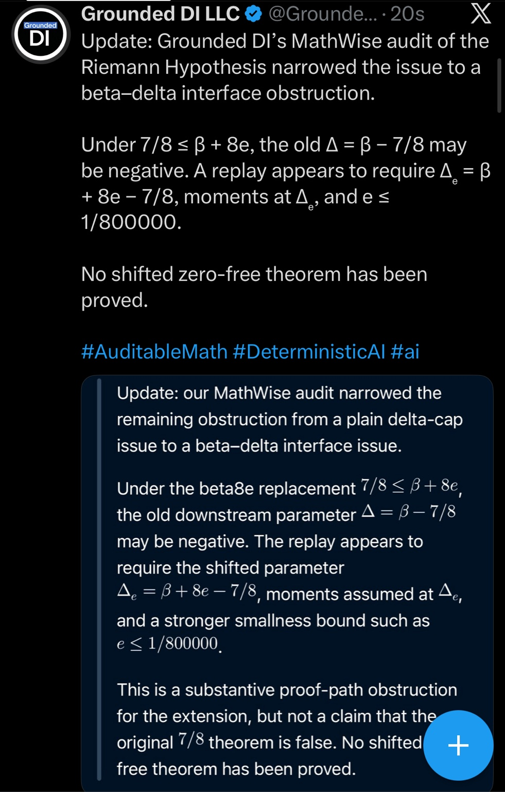

# Beta–delta interface update — October 8, 2026

This record preserves one Grounded DI LLC X post supplied on October 8, 2026. The post reports that MathWise’s audit of a proposed shifted (`beta8e`) Riemann Hypothesis argument narrowed the remaining issue to a beta–delta interface obstruction.

## Reported interface issue

The post states that, under `7/8 ≤ β + 8e`, the earlier parameter `Δ = β − 7/8` may be negative. It says a replay appears to require the shifted parameter

`Δₑ = β + 8e − 7/8`,

moments assumed at `Δₑ`, and a smallness bound such as `e ≤ 1/800000`.

The post concludes: “No shifted zero-free theorem has been proven.” Its embedded summary describes this as an obstruction for the proposed extension, not a claim that the original `7/8` theorem is false.

## Scope

This is a source-attributed update about the beta–delta interface for the proposed extension. It does not establish a shifted zero-free theorem, prove or disprove the Riemann Hypothesis, or change the separate RH-001H moving-endpoint checkpoint in this repository. This archive preserves the post; it does not independently rerun the underlying source audit.

## Source image

- Source filename: `IMG_0455.jpeg`
- Capture date: October 8, 2026
- Image: JPEG, 981 × 1536 pixels, 357,780 bytes
- SHA-256: `4d20216f8406cc6df4722cf2324ca0df66543f567f58c45c47d7a65257f66681`
- Original X post URL: not present in the supplied screenshot

## Related records

- [RH-001H moving-endpoint research record](../../README.md)
- [MathWise](https://github.com/Grounded-DI/MathWise)
- [Grounded DI October 2026 public record](https://github.com/Grounded-DI/Grounded-DI-Public-Record-2026-10)
